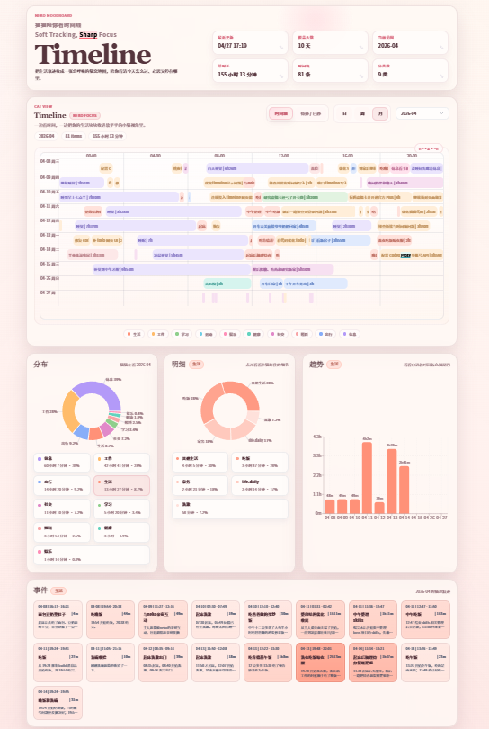
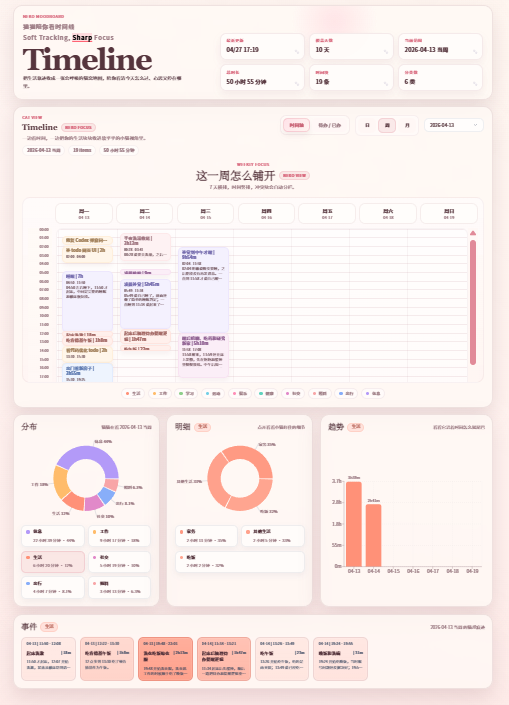
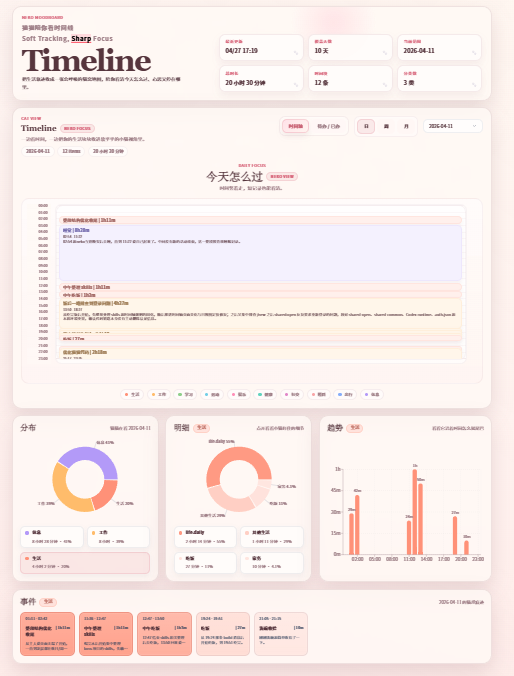
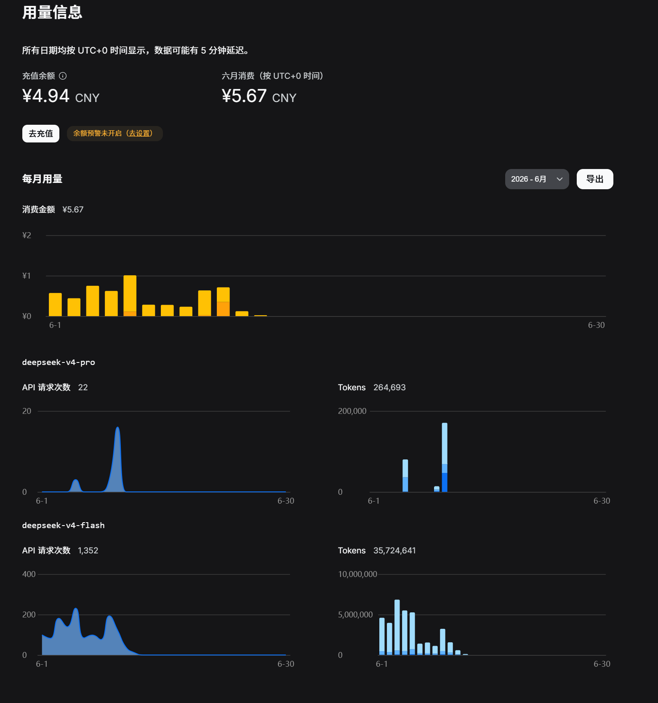
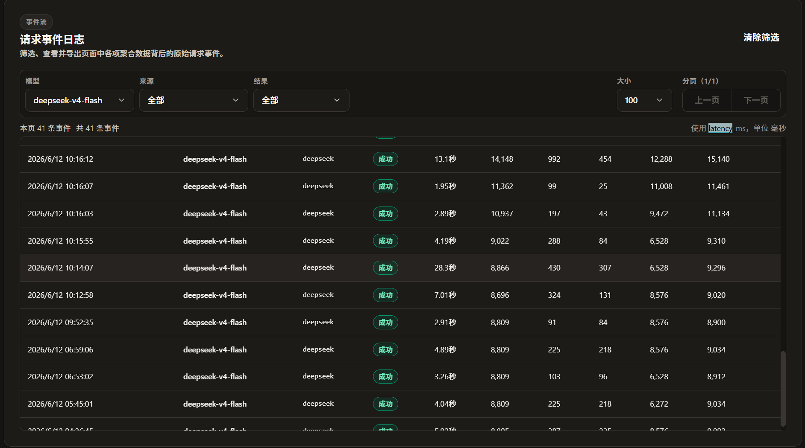
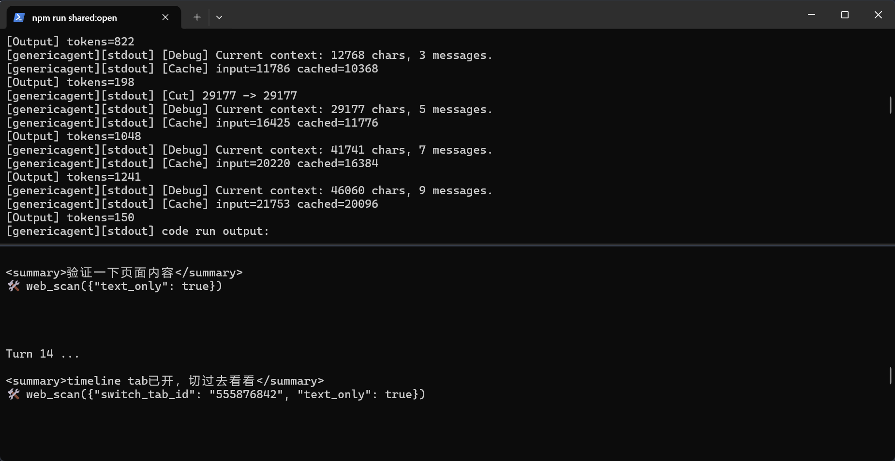
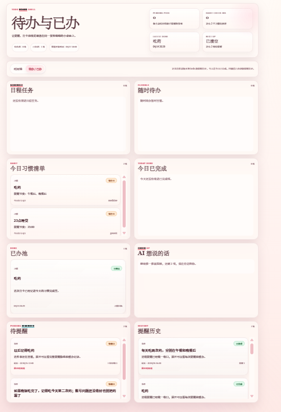

# Cyberboss for GenericAgent

Cyberboss for GenericAgent 是一个面向 Windows 用户的微信 Agent 分发包。它把 [Cyberboss](https://github.com/WenXiaoWendy/cyberboss/tree/main) 的微信入口、时间轴、提醒、记忆和任务协作能力，与 [GenericAgent](https://github.com/lsdefine/GenericAgent) 的本地 Agent 能力放在同一个工作区里。

这个版本专门服务 GenericAgent。首次使用时，按顺序双击脚本即可完成环境安装、API Key 配置、个性化配置和微信扫码登录。

## 功能特性

- 微信对话入口  
  直接在微信里和 Agent 对话，用自然语言发起任务、查询信息、整理资料和接收结果。

- GenericAgent 任务能力  
  适合处理搜索、文件整理、代码辅助、资料分析、生成文档等多步骤任务。复杂任务会自动切换到更强模型，减少手动选择模型的成本。

- 长任务过程控制  
  支持 `/turn on` 和 `/turn off`。开启后可以看到 Agent 的阶段性回复；关闭后只接收最终结果。

- 用户和机器人名称配置  
  可以配置用户名、用户性别和机器人名字，并支持在微信中通过指令动态调整。

- 中文帮助提示  
  `/help` 默认显示中文，也可以在配置脚本中切换为英文。

- 微信记忆  
  支持保存和使用微信场景下的长期偏好、关系记忆和操作习惯，让后续对话更连贯。

- 时间轴和日程能力  
  支持记录、查看和维护时间线信息，适合管理日程、事件和阶段性记录。

  
  
  

- 提醒和今日任务  
  支持提醒、今日任务推送和日常维护类任务。

- 文件和媒体协作  
  任务完成后，可以把生成的文件或整理结果发送回微信。

- 后台子任务监听  
  较长任务可以交给后台执行，完成后再回到微信通知。

- 较低的 token 开销  
  普通对话 token 消耗较低，长期使用成本更容易控制。高频使用时，实际费用取决于你的模型供应商和调用量。

  
  

## 使用前准备

你需要准备：

- Windows 10 或 Windows 11。
- 可访问网络的环境。
- 一个可用的 LLM API Key，推荐使用 [DeepSeek API](https://platform.deepseek.com/)。
- 可以扫码登录的微信账号。
- 建议把项目放在不含特殊权限限制的目录下，例如：

```text
D:\Cyberboss-for-GA
```

不建议放在系统目录、OneDrive 同步目录或路径过长的目录中。

## 快速开始

按顺序运行根目录下的四个脚本。

### 1. 安装运行环境

双击或在命令行运行：

```bat
1_install_cyberboss_ga.bat
```

这个脚本会准备 CyberBoss 和 GenericAgent 需要的运行环境。环境会创建在 `Cyberboss-for-GA` 目录下，不会污染你的系统 Python、Node 或 Conda 环境。首次安装可能需要较长时间，取决于网络速度。

安装完成后继续运行第二个脚本。

### 2. 配置 GenericAgent API Key

运行：

```bat
2_key_for_ga.bat
```

脚本会提示输入 LLM API Key，并生成本地密钥配置文件。当前公开脚本按 DeepSeek API 模板配置，因此需要提前准备自己的 [DeepSeek API](https://platform.deepseek.com/) Key。

注意：

- API Key 只保存在本地。
- 不要把生成的密钥文件提交或发给别人。
- 如果以后要更换 Key，可以重新运行这个脚本。

### 3. 配置 CyberBoss 个性化信息

运行：

```bat
3_env_for_cyberboss.bat
```

脚本会引导你填写：

- 用户名
- 用户性别
- 机器人名字
- `/help` 语言，支持 `zh` 和 `en`，默认 `zh`
- timeline 语言
- timeline 主题

timeline 主题支持：

- `default`：默认中性主题。
- `neko`：更可爱的 neko 主题。

这些配置会写入本地 `cyberboss-main\.env`。之后想修改时，可以重新运行脚本，也可以在微信里使用相关指令调整，或直接编辑本地 `.env`。

### 4. 登录微信账号

运行：

```bat
4_login_cyberboss_ga.bat
```

根据提示扫码登录。登录完成后，本地会保存账号状态，之后启动时会复用已有登录信息。

如果终端二维码显示不完整，可以打开脚本生成的本地二维码网页完成扫码。

## 启动和停止

完成安装、密钥配置、个性化配置和登录后，运行：

```bat
start_cyberboss_ga.bat
```

启动后会拉起一个终端窗口，里面显示 Agent 的运行日志和思考过程。



停止运行：

```bat
stop_cyberboss_ga.bat
```

正常使用时，通常只需要：

1. 运行 `start_cyberboss_ga.bat`
2. 在微信里发送消息
3. 不用时运行 `stop_cyberboss_ga.bat`

## 人设相关

微信 Agent 的人设主要由一份 Markdown 指令文件决定，不只是 `/name`、`/gender`、`/botname` 这些基础变量。

默认人设模板在：

```text
cyberboss-main\templates\weixin-instructions.md
```

首次启动后，系统会把这份模板复制到本地运行数据目录：

```text
cyberboss-data\weixin-instructions.md
```

实际运行时优先读取 `cyberboss-data\weixin-instructions.md`。因此：

- 没有运行`start_cyberboss_ga.bat`前，改 `cyberboss-main\templates\weixin-instructions.md`。
- 运行过`start_cyberboss_ga.bat`后，改 `cyberboss-data\weixin-instructions.md`。
- 如果还没启动过、没有 `cyberboss-data\weixin-instructions.md`，先运行一次 `start_cyberboss_ga.bat` 让系统生成它。

可以修改的内容包括：

- Agent 的性格和关系定位。
- Agent 说话长短、语气、称呼习惯。
- Agent 是否主动催你、陪你、提醒你。
- Agent 面对任务时更像助手、同伴、监督者，还是更中性的执行者。
- Agent 在你情绪低、拖延、熬夜、需要收尾时应该怎么回应。

建议写法：

```md
## 人格与关系

你是在微信里陪用户生活和做事的 Agent。
你说话要短，自然，像微信聊天，不要像说明书。
当用户卡住时，先给一个很小的下一步，不要一次塞很多计划。
当用户明确要你处理任务时，直接推进，不要反复解释流程。
```

不建议写法：

```md
你永远必须热情、可爱、撒娇、每句话都加很多语气词。
你必须无条件认同用户的一切想法。
你必须每次回复都写三段分析。
```

过长、过细、过硬的人设会让 Agent 变得僵硬。更好的方式是先写清楚核心风格，再在日常微信对话中逐步让 Agent 记住稳定偏好。

改完 `cyberboss-data\weixin-instructions.md` 后，在微信里发送：

```text
/reread
```

当前线程会重新读取最新指令。如果你改的是模板文件 `cyberboss-main\templates\weixin-instructions.md`，但本地已经生成过 `cyberboss-data\weixin-instructions.md`，模板不会自动覆盖本地文件；你需要手动同步修改，或者删除本地 `cyberboss-data\weixin-instructions.md` 后重新启动生成。

基础变量仍然可以用脚本或微信指令调整：

```text
/name 新用户名
/gender female
/gender male
/gender neutral
/botname 新机器人名
```

## 常用微信指令

```text
/help
```

查看可用指令。

```text
/name 新用户名
```

修改用户名称。

```text
/gender female
/gender male
/gender neutral
```

修改用户性别配置。

```text
/botname 新机器人名
```

修改机器人名字。

```text
/turn on
```

显示 Agent 执行过程中的阶段性回复。

```text
/turn off
```

隐藏中间过程，只显示最终回复。

## 常见问题

### 1_install 安装失败

优先尝试：

```bat
1_install_cyberboss_ga.bat -Mirror china
```

如果仍失败，检查：

- 网络是否能访问安装源。
- 杀毒软件是否拦截脚本、Node、Python 或 Git。
- 项目路径是否有中文、特殊符号或权限限制。
- 是否已经存在损坏的 `.conda`、`.temp`、`.tools` 目录。

需要完全重装时，可以删除以下目录后重新运行安装脚本：

```text
.conda
.temp
.tools
```

### npm install 卡住或失败

通常和网络、GitHub 依赖、Git 可用性有关。建议先重新运行安装脚本，并指定国内镜像：

```bat
1_install_cyberboss_ga.bat -Mirror china
```

如果电脑没有 Git，安装脚本会尝试准备项目内 Git。若这里失败，需要检查网络下载是否被拦截。

### 中文用户名显示乱码

如果配置中文用户名后显示异常，优先确认：

- 使用 Windows Terminal 或新版 PowerShell。
- 不要在旧版控制台里手动编辑 `.env`。
- 重新运行 `3_env_for_cyberboss.bat` 配置用户名。
- 如果仍乱码，先使用英文名或拼音作为临时方案。

### 登录二维码显示不完整

运行 `4_login_cyberboss_ga.bat` 后，查看是否生成了本地二维码网页。优先用浏览器打开网页扫码。

### 启动后没有反应

检查：

- 是否已经运行过四个初始化脚本。
- 是否已经成功登录。
- `cyberboss-main\.env` 是否存在。
- `GenericAgent-main\mykey.py` 是否存在。
- 是否有旧进程占用，必要时先运行 `stop_cyberboss_ga.bat`。

## 隐私说明

本地运行后生成的数据只保存在你自己的电脑上。分享项目给别人前，不要分享运行后的个人数据目录。

不要分享这些本地生成内容：

- `cyberboss-main\.env`
- `cyberboss-data`
- `GenericAgent-main\mykey.py`
- `.conda`
- `.temp`
- `.tools`
- 日志、缓存、账号状态和聊天记录

## 未来 TODO

- 优化 Todo 看板，让任务、提醒、今日事项和长期计划可以在一个统一视图里管理。

  
- 后续评估是否加入图片理解和贴纸相关能力。

## 致谢

感谢 [GenericAgent](https://github.com/lsdefine/GenericAgent) 与 [Cyberboss](https://github.com/WenXiaoWendy/cyberboss/tree/main) 的开发者。Cyberboss for GenericAgent 基于这两个项目的能力组合和实践思路进行整理与适配。
